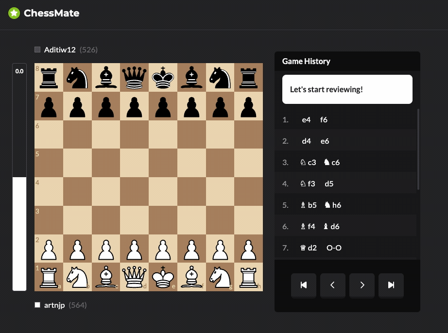

# AI-Powered Chess Game Analysis and Review Tool

A chess game analysis application that evaluates your games move-by-move using Stockfish and generates AI-powered feedback — similar to the game review features on Chess.com or Lichess.



## What It Does

Upload a chess game in PGN format and get detailed analysis including:

- **Position evaluation** — centipawn scores and mate-in-N detection for each move
- **Move classification** — identifies brilliant moves, great moves, best moves, good moves, inaccuracies, mistakes, blunders, and missed opportunities
- **Best move suggestions** — shows the engine's recommended line at each position
- **AI commentary** — human-readable explanations for suboptimal moves, powered by Google Gemini

## Architecture

```
┌──────────────┐     ┌──────────────┐     ┌──────────────┐
│   Frontend   │────▶│   Backend    │────▶│  PostgreSQL  │
│    (React)   │     │ (Spring Boot)│     │              │
└──────────────┘     └──────┬───────┘     └──────────────┘
                            │
               ┌────────────┼────────────┐
               ▼            ▼            ▼
         ┌──────────┐ ┌──────────┐ ┌──────────┐
         │ RabbitMQ │ │ Stockfish│ │ Vertex AI│
         │          │ │  Service │ │ (Gemini) │
         └──────────┘ └──────────┘ └──────────┘
```

| Service | Description |
|---------|-------------|
| **Frontend** | React 19 / TypeScript / Vite / Tailwind CSS web interface with interactive chessboard |
| **Backend** | Java 21 / Spring Boot 4 API — handles PGN parsing, game storage, analysis orchestration, and AI commentary |
| **PostgreSQL** | Stores games and analysis results (JSONB) |
| **RabbitMQ** | Message queues for async game analysis and commentary generation |
| **Stockfish Service** | Python asyncio TCP bridge exposing the Stockfish chess engine |
| **Vertex AI** | Google Gemini model for generating human-readable move commentary |

## Analysis Pipeline

When you upload a PGN, the following async pipeline runs:

1. **Parse & Save** — Backend parses the PGN, extracts metadata, and saves to PostgreSQL
2. **Queue Analysis** — Game ID is published to the analysis queue
3. **Stockfish Analysis** — Consumer evaluates each position, classifies moves, and identifies best lines
4. **Queue Commentary** — After analysis completes, game ID is published to the commentary queue
5. **AI Commentary** — Consumer sends suboptimal moves (inaccuracies, mistakes, blunders, misses) to Gemini for human-readable explanations
6. **Complete** — Frontend polls for status and displays the full analysis with commentary

## Getting Started

### Prerequisites

- Docker and Docker Compose
- Google Cloud credentials for AI commentary

### Quick Start

The easiest way to get started is with the included start script:

```bash
./start.sh
```

This will check dependencies, create a `.env` file with sensible defaults if needed, build all containers, and start the application.

### Start Script Options

| Option | Description |
|--------|-------------|
| `--build-only` | Only build containers, don't start them |
| `--no-build` | Start without rebuilding containers |
| `-d, --detached` | Run containers in background |
| `-h, --help` | Show help message |

### Manual Setup

Alternatively, you can run Docker Compose directly:

1. Create a `.env` file with database and RabbitMQ credentials
2. Add `vertex-ai-key.json` for AI commentary
3. Run:

```bash
docker compose up --build
```

### AI Commentary Setup

To enable AI-powered commentary:

1. Create a Google Cloud project with Vertex AI API enabled
2. Create a service account with Vertex AI User role
3. Download the JSON key and save as `vertex-ai-key.json` in the project root

### Access Points

| Service | URL |
|---------|-----|
| Frontend | http://localhost:3000 |
| Backend API | http://localhost:8080 |
| RabbitMQ Console | http://localhost:15672 |
